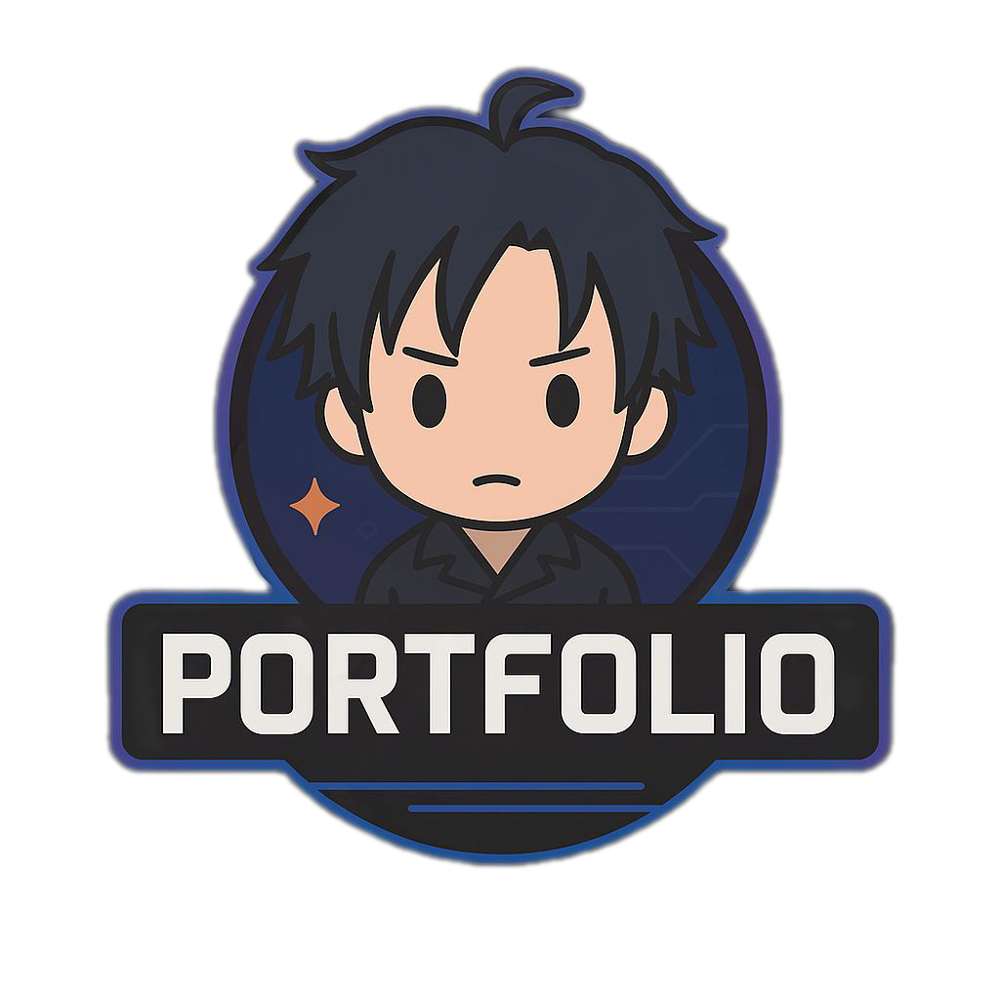
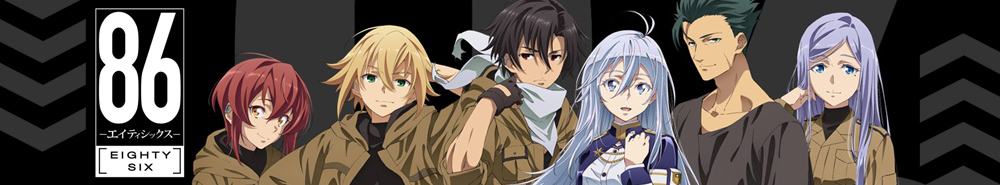
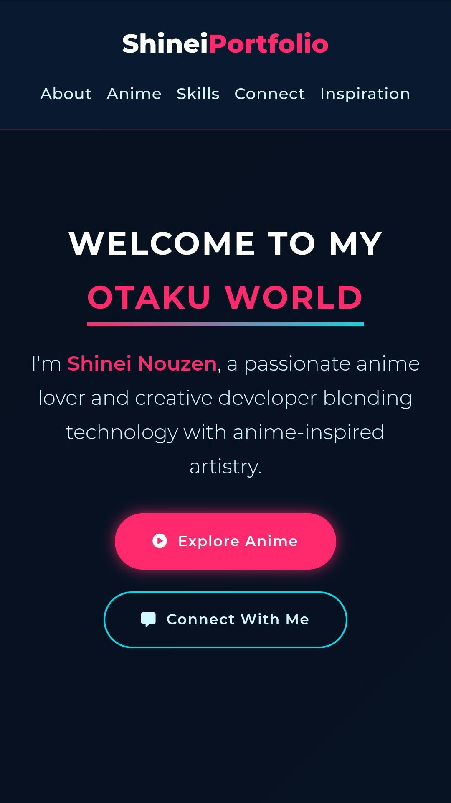
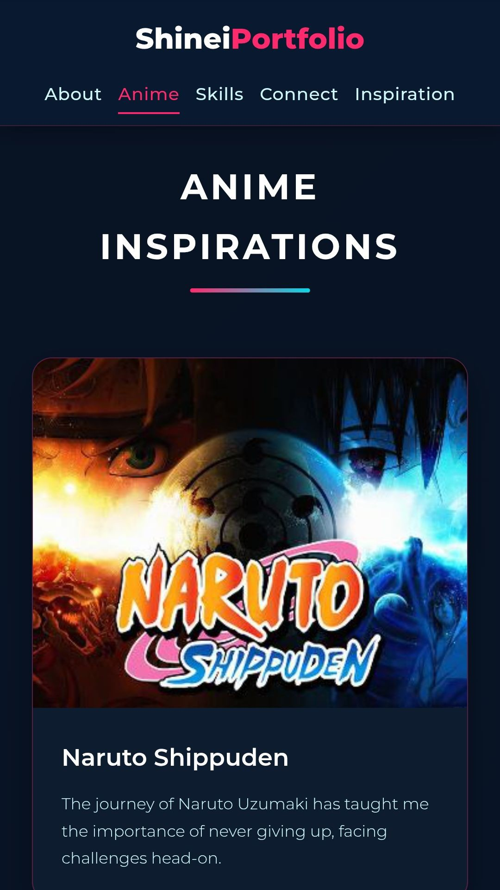
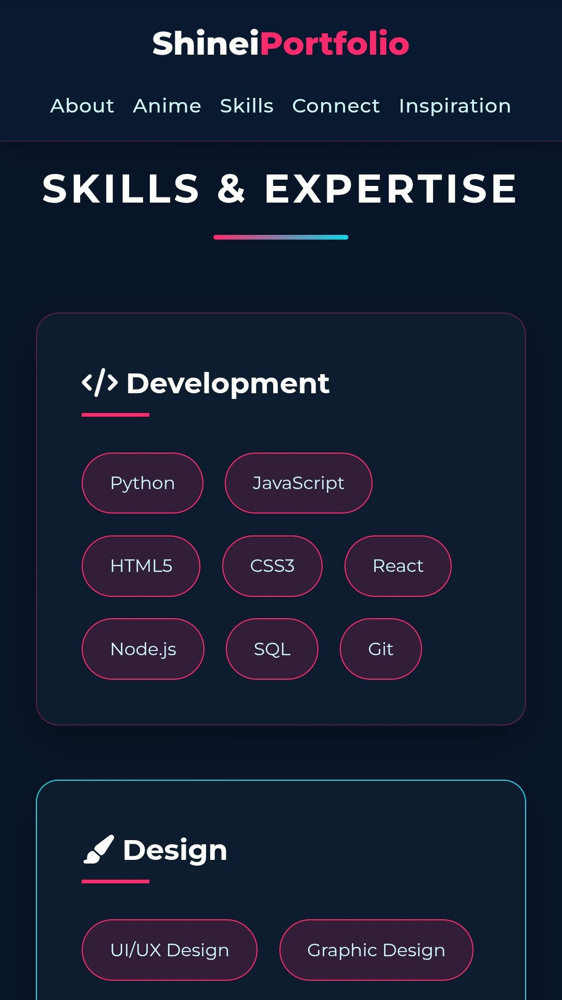
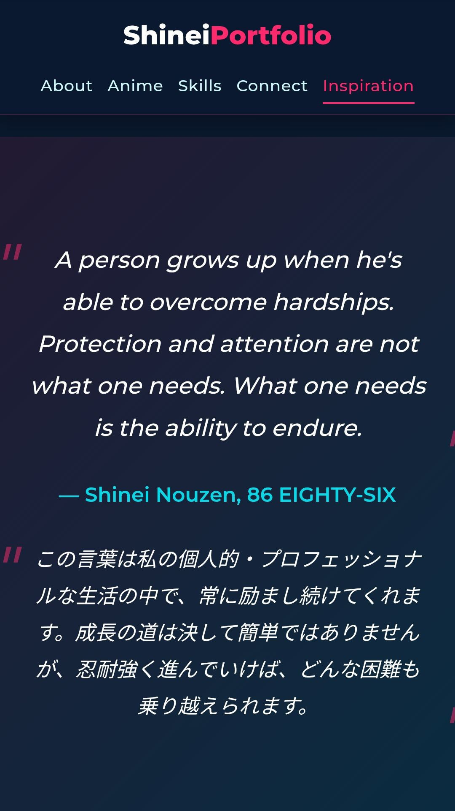
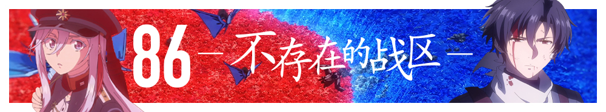

<div align="center">
  <a href="https://github.com/Shineii86/Source/logo.png">
    
  </a>

<h1> Shinei Portfolio</h1></div>




A modern, sleek anime-inspired portfolio website showcasing my passion for anime, programming, and creative design. Features dynamic animations, responsive layout, and immersive UI elements.

<div align="center">
  
[](https://shineii86.github.io/Portfolio/)

</div>

<h2> Features</h2>

- **Modern Anime Aesthetic** - Sleek dark theme with vibrant neon accents
- **Dynamic Animations** - Smooth hover effects, scroll animations, and transitions
- **Responsive Design** - Fully optimized for all device sizes
- **Interactive Elements** - Glowing buttons, animated cards, and floating effects
- **Anime Showcase** - Beautiful gallery of favorite anime with descriptions
- **Skills Section** - Interactive badges for technical and anime-related skills
- **Social Integration** - Stylish social media cards with direct links
- **Inspirational Quotes** - Featured anime quotes with Japanese translations

<h2> Technologies Used</h2>

- **HTML5** - Semantic markup structure
- **CSS3** - Advanced styling with Flexbox and Grid
- **JavaScript** - Interactive elements and animations
- **Font Awesome** - Icon library
- **Google Fonts** - Modern typography (Montserrat and Noto Sans JP)

<h2> Installation</h2>

No installation required! Simply clone the repository and open `index.html` in your browser:

```bash
git clone https://github.com/Shineii86/Portfolio.git
cd Portfolio
```
<h2> Customization</h2>

To personalize this portfolio:
1) Replace placeholder images in the HTML file
2) Update the anime list in the "Anime Inspirations" section
3) Modify the skills in the "Skills & Expertise" section
4) Update social media links in the "Connect With Me" section
5) Change the color scheme by editing the CSS variables:
```
:root {
    --primary: #ff2a6d;       /* Main accent color */
    --secondary: #05d9e8;    /* Secondary accent color */
    --accent: #d1f7ff;       /* Text accent color */
    --dark: #0a192f;         /* Dark background */
    --darker: #071120;       /* Darker background */
    --light: #ffffff;        /* Light text */
}
```
<h2> Preview</h2>
Section	Preview:

| Hero Section | Anime Gallery | Skills Section | Quotes Section |
| :--: | :-- | :--: | :-- |
|	 |  |  |  |

<h2>  License</h2>
  
This project is licensed under the MIT License - see the [LICENSE](LICENSE) file for details.

##  Loved My Work?

&nbsp;[Give a star to this project](https://github.com/Shineii86/Portfolio/) <br/>
&nbsp;[Follow me on GitHub](https://github.com/Shineii86/Shineii86)<br/>

>  Wondering where to get these animated emojis?
> [Visit here!](https://github.com/Shineii86/AniEmojis) You also should look around my other github repos. Maybe you'll find some cool useful stuff there.

##  Contact
> For inquiries or collaborations:
  
[](https://telegram.me/Shineii86 "Contact on Telegram")
[](https://instagram.com/ikx7.a "Follow on Instagram")
[](https://www.snapchat.com/add/ikx7.a "Add on Snapchat")
[](https://facebook.com/ikx7.a "Connect on Facebook")
[](https://twitter.com/Shineii86 "Follow on Twitter (X)")
[](https://wa.me/ "Chat on WhatsApp")
[](https://pinterest.com/ikx7a "Follow on Pinterest")
[](mailto:ikx7a@hotmail.com "Send an Email")




<div align="center">
  
[](https://github.com/Shineii86/Portfolio/commits)
  
  <sup><b>Copyright © 2025 <a href="https://telegram.me/Shineii86">Shinei Nouzen</a> All Rights Reserved</b></sup>
</div>
